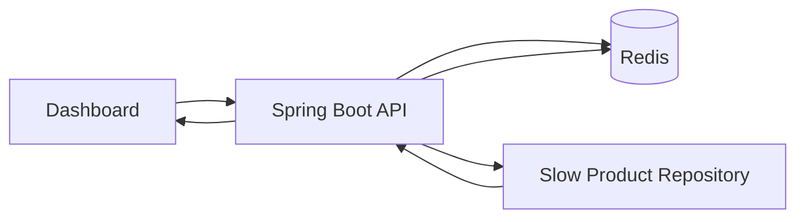

# Redis Cache Lab

Spring Boot + Redis lab that demonstrates the cache-aside pattern with visible hit/miss behavior, TTL, response headers, and latency deltas.

This is intentionally small: the project is built to act as portfolio proof for backend work around Redis caching, API design, observability, and production-style local execution.

## What It Demonstrates

- Cache-aside read path: API checks Redis first, falls back to a simulated slow repository, then writes back to Redis.
- TTL behavior: product cache entries expire after `PRODUCT_CACHE_TTL`.
- Reviewer-friendly proof: source, latency, and TTL are returned in both JSON and response headers.
- Metrics endpoint: total requests, hits, misses, bypasses, and hit rate.
- Local reproducibility: Redis, backend, and static dashboard run with Docker Compose.

## Architecture



## API Contract

```http
GET /api/products/{id}
GET /api/products/{id}?bypassCache=true
DELETE /api/cache/products/{id}
GET /api/metrics/cache
```

Example response:

```json
{
  "productId": "P1001",
  "name": "Wireless Inventory Scanner",
  "category": "Operations",
  "price": 1299.00,
  "inventory": 42,
  "storeId": "BLR-01",
  "source": "CACHE_HIT",
  "latencyMs": 18,
  "ttlSeconds": 47
}
```

Response headers:

```http
X-Cache-Status: CACHE_HIT
X-Product-TTL-Seconds: 47
X-Origin-Latency-Ms: 18
```

## Run Locally

```bash
docker compose up --build
```

Then open:

- Dashboard: `http://localhost:3000`
- Backend health: `http://localhost:8080/actuator/health`
- Metrics: `http://localhost:8080/api/metrics/cache`

Suggested demo path:

1. Fetch `P1001` once and observe `CACHE_MISS` with slower latency.
2. Fetch `P1001` again and observe `CACHE_HIT` with faster latency.
3. Click clear cache.
4. Fetch again and observe another `CACHE_MISS`.

## Local API Examples

```bash
curl -i http://localhost:8080/api/products/P1001
curl -i http://localhost:8080/api/products/P1001
curl -i "http://localhost:8080/api/products/P1001?bypassCache=true"
curl -i -X DELETE http://localhost:8080/api/cache/products/P1001
curl http://localhost:8080/api/metrics/cache
```

## Engineering Notes

The repository deliberately sleeps before returning product data so cache misses are visibly slower. In a real system this would represent a relational query, downstream service call, or expensive aggregation.

The cache adapter evicts corrupt JSON rather than returning a bad object. The service keeps source classification close to the read path so headers, JSON response, metrics, and UI state remain consistent.

## Case Study Summary

**Problem:** Product detail lookups often hit the same IDs repeatedly. Recomputing or refetching every request adds latency and load to downstream storage.

**Architecture:** Use a cache-aside pattern. The API reads Redis first. On miss or bypass, it loads from the repository, writes the serialized product to Redis with TTL, and returns a response with cache evidence.

**Trade-offs:** Cache-aside is simple and resilient, but stale reads are possible until TTL expiry or explicit eviction. This lab exposes `DELETE /api/cache/products/{id}` to model targeted invalidation.

**Production next steps:** Add Micrometer counters, Prometheus/Grafana dashboard, Testcontainers Redis integration tests, distributed tracing, and versioned cache keys for schema migrations.

## Project Structure

```text
redis-cache-lab/
  backend/
    src/main/java/in/vinaygupta/rediscachelab/
    src/test/java/in/vinaygupta/rediscachelab/
    Dockerfile
    pom.xml
  frontend/
    index.html
    styles.css
    app.js
  docker-compose.yml
  .env.example
  api-contract.md
  run-local.md
```
